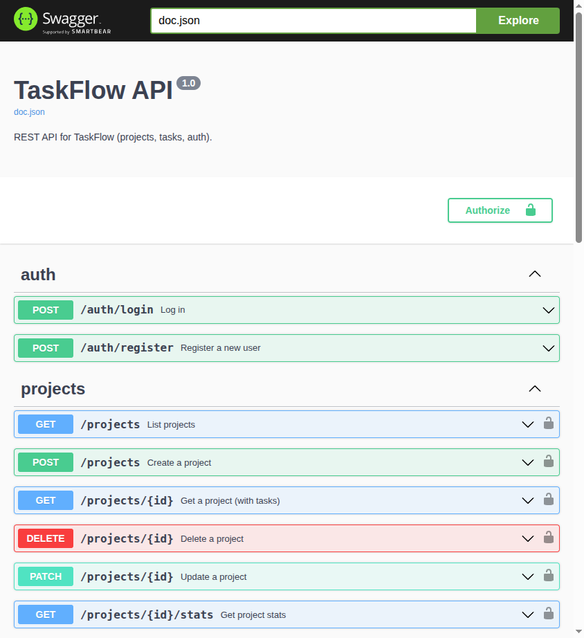

# TaskFlow

A minimal but complete task management system with authentication, relational data, a REST API, and a polished UI. Users can register, log in, create projects, add tasks, and assign them to team members.

## Tech Stack

| Layer      | Technology                                                        |
| ---------- | ----------------------------------------------------------------- |
| Backend    | Go 1.25, chi router, pgx (PostgreSQL driver), golang-jwt, bcrypt  |
| Frontend   | React 18, TypeScript, Vite 5, TanStack Query, React Hook Form    |
| Styling    | Tailwind CSS 3, custom component library (shadcn/ui inspired)     |
| Database   | PostgreSQL 16, golang-migrate for schema migrations               |
| Infra      | Docker Compose, multi-stage Dockerfiles, nginx                    |

---

## Architecture Decisions

**Backend structure:** The Go backend follows a layered architecture — `handler` → `repository` — with clear separation between HTTP concerns and database access. I chose `chi` for its lightweight, idiomatic middleware chaining and stdlib compatibility. `pgx` is used over `database/sql` for its native PostgreSQL type support and connection pooling via `pgxpool`.

**Authentication:** JWT with HMAC-SHA256 signing. The secret is loaded from an environment variable (never hardcoded). Passwords are hashed with bcrypt at cost 12. Auth state on the frontend is persisted in localStorage and restored on page refresh.

**Frontend architecture:** React with TypeScript and TanStack Query for server state management. This avoids manual loading/error state tracking and provides built-in cache invalidation. React Hook Form + Zod handle form validation with strong type safety. The UI components are built from scratch, inspired by shadcn/ui patterns, using Tailwind CSS utility classes.

**Optimistic updates:** Task status changes use TanStack Query's `onMutate`/`onError`/`onSettled` pattern — the UI updates immediately and reverts on error, providing a snappy experience.

**Database design:** PostgreSQL with explicit migration files (up + down) managed by golang-migrate. Tasks cascade-delete when their parent project is deleted. A `created_by` field on tasks tracks the creator separately from the assignee, enabling proper authorization on delete.

**What I intentionally left out:** WebSocket/SSE real-time updates (time constraint), drag-and-drop reordering, and dark mode toggle. These are listed in the "What You'd Do With More Time" section below.

---

## Running Locally

Assumes you have Docker and Docker Compose installed.

```bash
git clone https://github.com/sumansahoo1/taskflow-suman-sahoo.git
cd taskflow-suman-sahoo
cp .env.example .env
docker compose up --build
```

Notes:

- **Postgres port**: Postgres is published on host port **5433** by default (configurable via `POSTGRES_HOST_PORT` in `.env`). This avoids collisions with a locally running Postgres on 5432.

Once all three services are healthy:

- **Frontend:** `http://localhost:3000`
- **API:** `http://localhost:8080`

## API Docs (Swagger)



---

## Running Migrations

Migrations run **automatically** when the API container starts. The Go application uses `golang-migrate` programmatically — no manual step is required.

If you need to run them manually:

```bash
docker compose exec api ./api  # migrations run on startup
```

---

## Test Credentials

Two seed users are created automatically on first startup:

```text
Email:    test@example.com
Password: password123

Email:    andy@example.com
Password: password123
```

The seed also creates 15 total projects and 20 tasks per project so the UI has enough data to browse.

---

## API Reference

All endpoints return `Content-Type: application/json`. Protected endpoints require `Authorization: Bearer <token>`.

### Swagger (OpenAPI)

Once the API is running, open:

- Swagger UI: `http://localhost:8080/docs/`
- OpenAPI spec (YAML): `backend/docs/swagger.yaml`

### Authorization model (important behaviors)

| Area | Rule |
|---|---|
| **Project list** | You only see projects you **own** or where you have **at least one assigned task**. |
| **Project details** | Owner sees **all tasks**. Non-owner with access sees **only tasks assigned to them**. |
| **Project updates/deletes** | **Owner only**. |
| **Task creation** | Owner can create tasks for anyone. Non-owner with access may only create tasks **assigned to self** (and if omitted, assignee defaults to self). |
| **Task updates** | Allowed if project **owner** OR task **creator** OR task **assignee**. If you are only the assignee (not owner/creator), you may update **status only**. |
| **Task deletes** | Allowed if project **owner** OR task **creator**. |

### Integration tests

Backend integration tests spin up PostgreSQL using Testcontainers and exercise auth + core authorization.

```bash
cd backend
go test ./...
```

---

## What I'd Do With More Time

- **Dark mode:** The CSS variable system is already set up for it (`.dark` class). Would add a toggle in the navbar that persists to localStorage.
- **Drag-and-drop:** Use `@dnd-kit/core` for kanban-style task columns with drag to change status.
- **Real-time updates:** WebSocket or SSE connection for live task updates across browser tabs/users.
- **Better error handling:** More granular error types in Go (custom error types instead of string matching for duplicate key detection).
- **Rate limiting:** Add middleware to prevent brute-force login attempts.
- **Assignee picker:** Add a searchable assignee dropdown and optionally restrict choices to project members rather than all users.
- **CI/CD:** GitHub Actions pipeline for linting, testing, and building Docker images.
